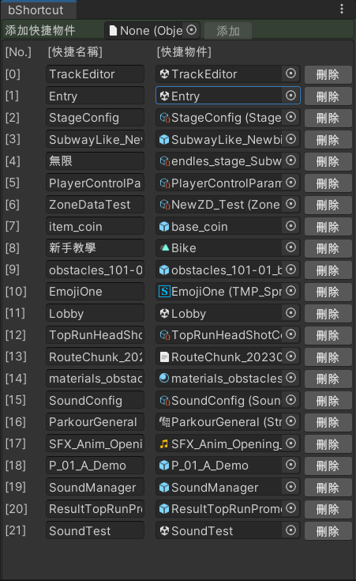
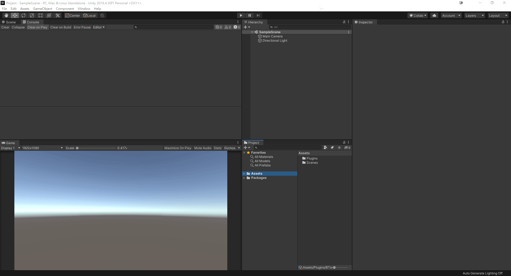

# BShortcut

The Unity tool for quickly selecting any object in the project.

p.s. I have already changed the plugin to the English version.

## Usage

Simply drag and drop your frequently used project files into the field.
You can add any file or even entire folders.

## Demo

## Notes
* Remember to save your project to save the settings
